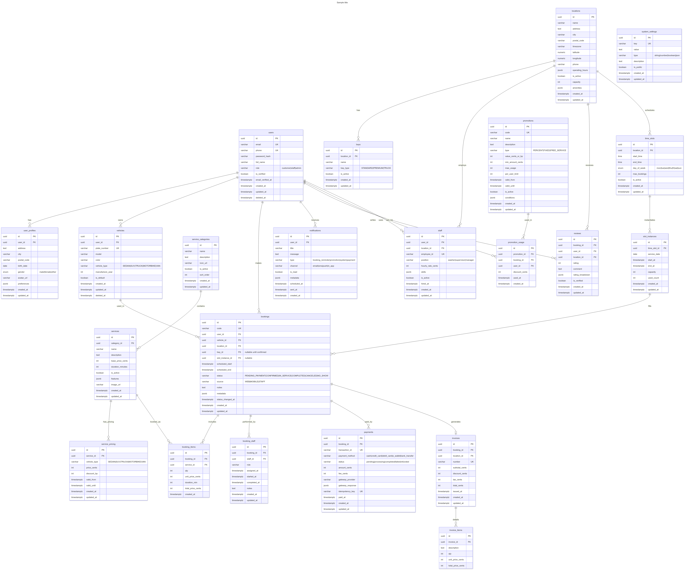

# Car Wash Booking System

A Laravel-based web application for managing car wash bookings, services, and customer interactions.

### Entity-Relationship Diagram (i use Postgresql for this schema)



## Installation

1. Clone the repository:

    ```
    git clone https://github.com/terminator791/car-wash-booking.git
    cd car-wash-booking
    ```

2. Install dependencies:

    ```
    composer install
    ```

3. Set up environment:

    - Copy `.env.example` to `.env`
    - Configure your database settings in `.env`

4. Generate application key:

    ```
    php artisan key:generate
    ```

5. Run migrations and seeders:

    ```
    php artisan migrate:fresh --seed
    ```

6. Build assets:

    ```

    ```

7. Start the development server:
    ```
    php artisan serve
    ```

## Usage

-   Access the application at `http://localhost:8000`
-   Register as a user or log in as an admin
-   Browse services, make bookings, and manage your profile

## Database Schema

The application uses the following main models:

-   Users & UserProfiles
-   Locations & Bays
-   Vehicles
-   ServiceCategories, Services, & ServicePricing
-   TimeSlots & SlotInstances
-   Bookings, BookingItems, & BookingStaff
-   Payments, Invoices, & InvoiceItems
-   Promotions & PromotionUsage
-   Reviews & Notifications
-   Staff & SystemSettings
